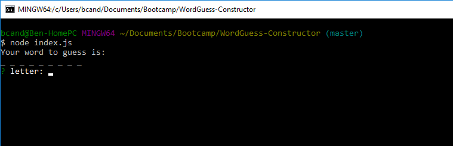
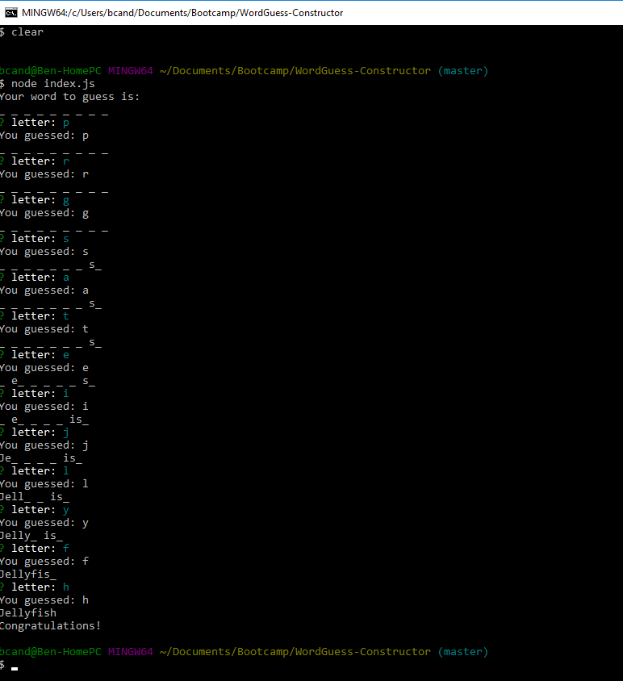

# WordGuess-Constructor
Command line word guess game using javascript constructors


WordGuess-Constructor is a command line word guess game using Constructors (or in this case ES6 class with constructors) and separate
modules to create a word guess game.  Running the program selects a random word to guess from store of possible words and loops through
and inquirer prompt to collect each letter guess unitl the word is completely guessed.

### See it in action

Step 1) Launch the app by navigating to the direcotory and running it with.  This selects a random word a prints blank spaces for each letter.
```
node index.js

```
Step 2) Guess a letter.  If the letter matches a letter in the word, it will appear in the print out.  Continue guessing until you've completed the word.

